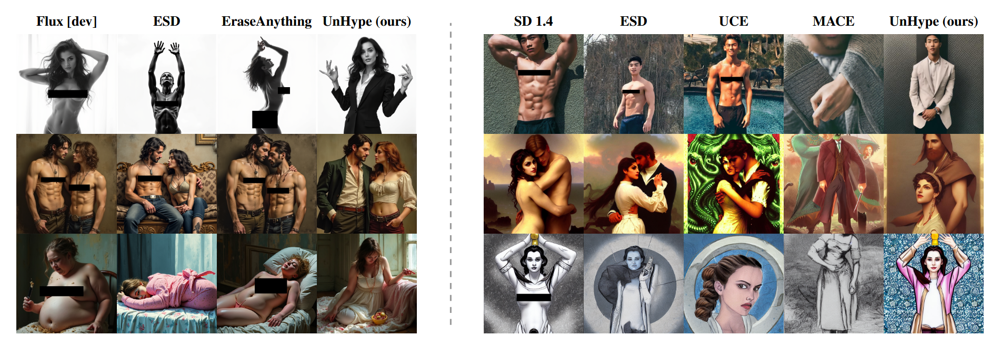

<div align="center">

# UnHype: CLIP-Guided Hypernetworks for Dynamic LoRA Unlearning

Piotr Wójcik*, Maksym Petrenko*, Wojciech Gromski*, Przemysław Spurek, Maciej Zięba <br>
(* denotes equal contribution)

[](https://arxiv.org/abs/2602.03410)
[](https://github.com/gmum/UnHype)

</div>



This repository contains the implementation for the paper **UnHype: CLIP-Guided Hypernetworks for Dynamic LoRA Unlearning**.

**Abstract:** Recent advances in large-scale diffusion models have intensified concerns about their potential misuse, particularly in generating realistic yet harmful or socially disruptive content. This challenge has spurred growing interest in effective machine unlearning, the process of selectively removing specific knowledge or concepts from a model without compromising its overall generative capabilities. Among various approaches, Low-Rank Adaptation (LoRA) has emerged as an effective and efficient method for fine-tuning models toward targeted unlearning. However, LoRA-based methods often exhibit limited adaptability to concept semantics and struggle to balance removing closely related concepts with maintaining generalization across broader meanings. Moreover, these methods face scalability challenges when multiple concepts must be erased simultaneously. To address these limitations, we introduce UnHype, a framework that incorporates hypernetworks into single- and multi-concept LoRA training. The proposed architecture can be directly plugged into Stable Diffusion as well as modern flow-based text-to-image models, where it demonstrates stable training behavior and effective concept control. During inference, the hypernetwork dynamically generates adaptive LoRA weights based on the CLIP embedding, enabling more context-aware, scalable unlearning. We evaluate UnHype across several challenging tasks, including object erasure, celebrity erasure, and explicit content removal, demonstrating its effectiveness and versatility.

## Setup

```bash
pip install -r requirements.txt
```

## Training

Training is configured via YAML files. See `configs/nudity/` for examples. The backend (SD or Flux) is auto-detected from the config.

More configs for CIFAR10 and celebrity removal are coming soon.

### Stable Diffusion 1.4

```bash
python train.py --config configs/nudity/nudity_sd.yaml
```

### Flux 1 \[dev\]

```bash
python train.py --config configs/nudity/nudity_flux.yaml
```

## Generation

### Stable Diffusion

```bash
python generate.py --task nudity \
    --config configs/nudity/nudity_sd.yaml \
    --lora-path output/nudity_sd/LoRA_fusion_model/hyper_lora_final.pth \
    --prompts-csv data/I2P_prompts_4703.csv \
    --output-dir output/nudity_sd/images
```

### Flux

```bash
python generate.py \
    --config configs/nudity/nudity_flux.yaml \
    --csv_path data/I2P_prompts_4703.csv \
    --lora_path output/nudity_flux/LoRA_model/hyper_lora.pth \
    --output_dir output/flux_images
```

## Citation

If you find this work useful, please consider citing our paper.

```
@misc{wojcik2026unhype,
  author    = {Piotr W{\'o}jcik and Maksym Petrenko and Wojciech Gromski and Przemys{\l}aw Spurek and Maciej Zi{\k{e}}ba},
  title     = {UnHype: {CLIP}-Guided Hypernetworks for Dynamic {LoRA} Unlearning},
  year      = {2026},
  eprint    = {2602.03410},
  primaryClass = {cs.CV},
  url       = {https://arxiv.org/abs/2602.03410}
}
```
